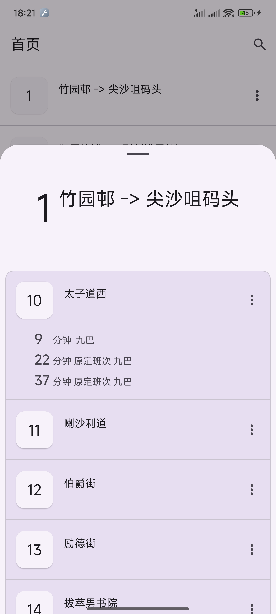

# HK BusNow 我巴士呢
**HK BusNow** 是一款专为香港巴士乘客提供巴士到站时间和路线信息的应用  

## 应用特点
- 使用MD3设计风格，无广告干扰
- 已支持查询九巴、城巴到站时间

## 开发初衷
官方应用的广告严重影响了使用体验，因此 **HK BusNow** 的开发目标是为用户提供一个无广告、纯粹的巴士到站时间查询工具

## 数据来源 [開放數據平台](https://data.gov.hk/)
[九巴数据](https://data.gov.hk/sc-data/dataset/hk-td-tis_21-etakmb/)  
[城巴数据](https://data.gov.hk/sc-data/dataset/ctb-eta-transport-realtime-eta/)

## 应用截图 (正在开发)

